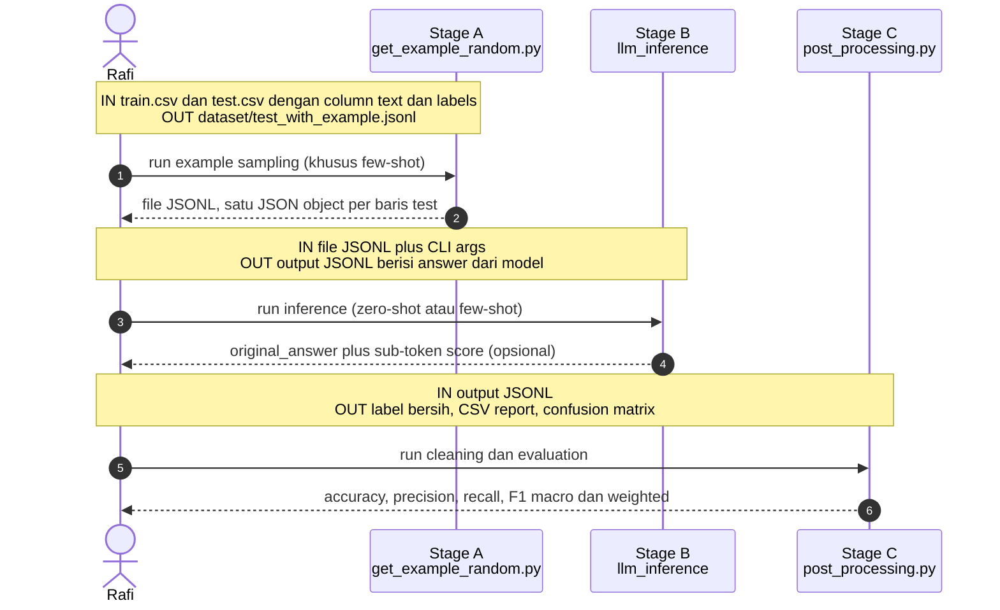
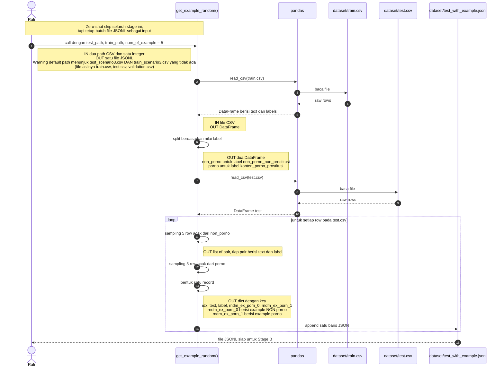
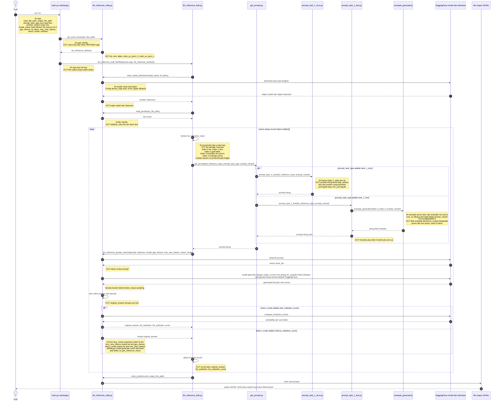
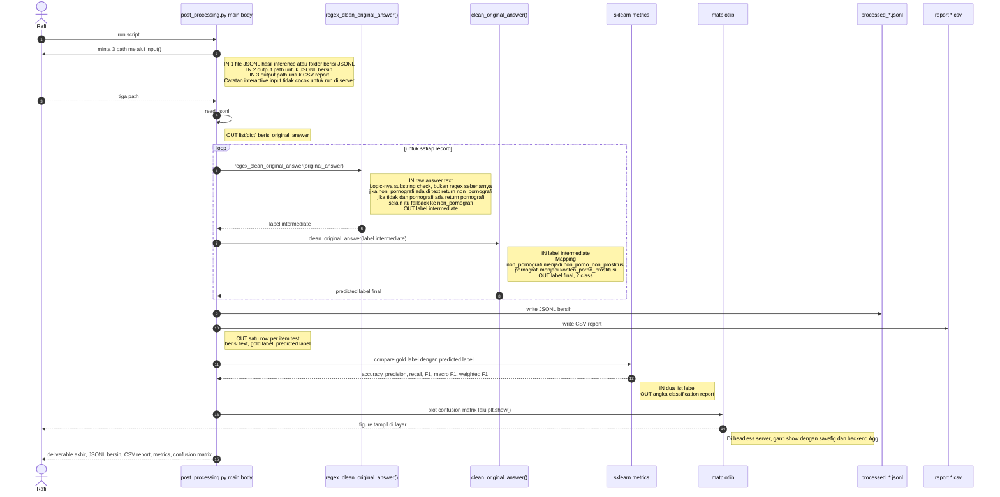

# Overview Pipeline

```mermaid
sequenceDiagram
    autonumber
    actor R as Rafi
    participant A as Stage A<br/>get_example_random.py
    participant B as Stage B<br/>llm_inference
    participant C as Stage C<br/>post_processing.py

    Note over R,A: IN train.csv dan test.csv dengan column text dan labels<br/>OUT dataset/test_with_example.jsonl
    R->>A: run example sampling (khusus few-shot)
    A-->>R: file JSONL, satu JSON object per baris test

    Note over R,B: IN file JSONL plus CLI args<br/>OUT output JSONL berisi answer dari model
    R->>B: run inference (zero-shot atau few-shot)
    B-->>R: original_answer plus sub-token score (opsional)

    Note over R,C: IN output JSONL<br/>OUT label bersih, CSV report, confusion matrix
    R->>C: run cleaning dan evaluation
    C-->>R: accuracy, precision, recall, F1 macro dan weighted
```

# Few-Shot Preparation (Stage A)

```mermaid
sequenceDiagram
    autonumber
    actor R as Rafi
    participant GE as get_example_random()
    participant PD as pandas
    participant TR as dataset/train.csv
    participant TE as dataset/test.csv
    participant OUT as dataset/test_with_example.jsonl

    Note over R,GE: Zero-shot skip seluruh stage ini,<br/>tapi tetap butuh file JSONL sebagai input
    R->>GE: call dengan test_path, train_path, num_of_example = 5
    Note right of R: IN dua path CSV dan satu integer<br/>OUT satu file JSONL<br/>Warning default path menunjuk test_scenario3.csv DAN train_scenario3.csv yang tidak ada<br/>(file aslinya train.csv, test.csv, validation.csv)

    GE->>PD: read_csv(train.csv)
    PD->>TR: baca file
    TR-->>PD: raw rows
    PD-->>GE: DataFrame berisi text dan labels
    Note right of GE: IN file CSV<br/>OUT DataFrame

    GE->>GE: split berdasarkan nilai label
    Note right of GE: OUT dua DataFrame<br/>non_porno untuk label non_porno_non_prostitusi<br/>porno untuk label konten_porno_prostitusi

    GE->>PD: read_csv(test.csv)
    PD->>TE: baca file
    TE-->>PD: raw rows
    PD-->>GE: DataFrame test

    loop untuk setiap row pada test.csv
        GE->>GE: sampling 5 row acak dari non_porno
        Note right of GE: OUT list of pair, tiap pair berisi text dan label
        GE->>GE: sampling 5 row acak dari porno
        GE->>GE: bentuk satu record
        Note right of GE: OUT dict dengan key<br/>idx, text, label, rndm_ex_porn_0, rndm_ex_porn_1<br/>rndm_ex_porn_0 berisi example NON porno<br/>rndm_ex_porn_1 berisi example porno
        GE->>OUT: append satu baris JSON
    end
    OUT-->>R: file JSONL siap untuk Stage B
```

# Inference (Stage B)

```mermaid
sequenceDiagram
    autonumber
    actor R as Rafi
    participant MN as main.py main(args)
    participant UT as llm_inference_utilty.py
    participant BK as llm_inference_bulk.py
    participant GP as get_prompt.py
    participant PZ as prompt_task_1_zero.py
    participant PF as prompt_task_1_few.py
    participant EG as example_generator()
    participant HF as HuggingFace model dan tokenizer
    participant OF as file output JSONL

    R->>MN: run CLI
    Note right of R: IN args<br/>input_file_path, output_file_path,<br/>prompt_task_type zero atau few,<br/>prompt_variant misal 115,<br/>model_name misal Mistral-7B-Instruct-v0.2,<br/>gpu_device, hf_token, max_new_tokens,<br/>return_mode, verbose

    MN->>UT: get_jsonl_keys(input_file_path)
    Note right of MN: IN path JSONL<br/>OUT nama key dari baris PERTAMA saja
    UT-->>MN: list_inference_attribute
    Note right of UT: OUT idx, text, label, rndm_ex_porn_0, rndm_ex_porn_1

    MN->>BK: llm_inference_bulk_file2file(semua args, list_inference_attribute)
    Note right of MN: IN args plus list key<br/>OUT file output yang sudah ditulis

    BK->>UT: load_model_tokenizer(model_name, hf_token)
    UT->>HF: download atau load weights
    Note right of UT: IN model name dan token<br/>Config device_map auto, torch_dtype bfloat16
    HF-->>UT: object model dan object tokenizer
    UT-->>BK: (model, tokenizer)
    Note right of UT: OUT tuple model dan tokenizer

    BK->>UT: read_jsonl(input_file_path)
    UT-->>BK: list of dict
    Note right of UT: IN file JSONL<br/>OUT list[dict], satu dict per baris test

    loop untuk setiap record dalam list[dict]
        BK->>BK: bentuk list_inference_input
        Note right of BK: IN record dict dan urutan key<br/>OUT list dengan susunan<br/>index 0 idx, index 1 text,<br/>index 2 gold label,<br/>index 3 example non porno,<br/>index 4 example porno<br/>Catatan akses ini positional jadi fragile

        BK->>GP: get_prompt(list_inference_input, prompt_task_type, prompt_variant)
        alt prompt_task_type adalah task_1_zero
            GP->>PZ: prompt_task_1_zero(list_inference_input, prompt_variant)
            Note right of PZ: IN hanya index 1, yaitu text uji<br/>OUT prompt string berisi task, aturan,<br/>dan dua answer yang diizinkan<br/>pornografi atau non_pornografi
            PZ-->>GP: prompt string
        else prompt_task_type adalah task_1_few
            GP->>PF: prompt_task_1_few(list_inference_input, prompt_variant)
            PF->>EG: example_generator(index 4, index 3, prompt_variant)
            Note right of EG: IN example porno dulu, lalu example non porno<br/>num_ex dibaca dari digit ketiga prompt_variant<br/>115 menghasilkan 5<br/>OUT blok example bernomor, urutan bergantian<br/>porno lalu non porno, total 10 baris
            EG-->>PF: string blok example
            PF-->>GP: prompt string utuh
            Note right of PF: OUT instruksi plus blok Contoh plus text uji
        end
        GP-->>BK: prompt string

        BK->>UT: llm_inference_greedy_search(prompt, tokenizer, model, gpu_device, max_new_tokens, return_mode)
        UT->>HF: tokenize prompt
        HF-->>UT: tensor input_ids
        Note right of UT: OUT token id dari prompt
        UT->>HF: model.generate dengan output_scores true (tanpa do_sample=False eksplisit,<br/>jadi greedy hanya karena default HuggingFace)
        HF-->>UT: generated ids plus raw scores
        Note right of UT: Greedy berarti deterministic, tanpa sampling
        UT->>UT: slice token prompt, lalu decode
        Note right of UT: OUT original_answer berupa raw text
        alt return_mode adalah with_subtoken_score
            UT->>HF: compute_transition_scores
            HF-->>UT: probability per sub-token
            UT-->>BK: original_answer, list_subtoken, list_subtoken_score
        else return_mode adalah without_subtoken_score
            UT-->>BK: hanya original_answer
            Note right of UT: Known bug, urutan argument salah di sini<br/>max_new_tokens masuk ke slot gpu_device,<br/>return_mode masuk ke slot max_new_tokens,<br/>akibatnya model.generate crash dan hasil<br/>jadi failed_to_get_inference_result
        end

        BK->>BK: attach hasil ke record
        Note right of BK: OUT record plus original_answer,<br/>list_subtoken, list_subtoken_score
    end

    BK->>UT: write_jsonl(records, output_file_path)
    UT->>OF: write semua baris
    OF-->>R: output JSONL, field sama seperti input plus field answer
```

# Cleaning and eval (Stage C)

```mermaid
sequenceDiagram
    autonumber
    actor R as Rafi
    participant PP as post_processing.py main body
    participant RC as regex_clean_original_answer()
    participant CC as clean_original_answer()
    participant SK as sklearn metrics
    participant PL as matplotlib
    participant O1 as processed_*.jsonl
    participant O2 as report *.csv

    R->>PP: run script
    PP->>R: minta 3 path melalui input()
    Note right of PP: IN 1 file JSONL hasil inference atau folder berisi JSONL<br/>IN 2 output path untuk JSONL bersih<br/>IN 3 output path untuk CSV report<br/>Catatan interactive input tidak cocok untuk run di server
    R-->>PP: tiga path

    PP->>PP: read_jsonl
    Note right of PP: OUT list[dict] berisi original_answer

    loop untuk setiap record
        PP->>RC: regex_clean_original_answer(original_answer)
        Note right of RC: IN raw answer text<br/>Logic-nya substring check, bukan regex sebenarnya<br/>jika non_pornografi ada di text return non_pornografi<br/>jika tidak dan pornografi ada return pornografi<br/>selain itu fallback ke non_pornografi<br/>OUT label intermediate
        RC-->>PP: label intermediate
        PP->>CC: clean_original_answer(label intermediate)
        Note right of CC: IN label intermediate<br/>Mapping<br/>non_pornografi menjadi non_porno_non_prostitusi<br/>pornografi menjadi konten_porno_prostitusi<br/>OUT label final, 2 class
        CC-->>PP: predicted label final
    end

    PP->>O1: write JSONL bersih
    PP->>O2: write CSV report
    Note right of PP: OUT satu row per item test<br/>berisi text, gold label, predicted label

    PP->>SK: compare gold label dengan predicted label
    SK-->>PP: accuracy, precision, recall, F1, macro F1, weighted F1
    Note right of SK: IN dua list label<br/>OUT angka classification report

    PP->>PL: plot confusion matrix lalu plt.show()
    PL-->>R: figure tampil di layar
    Note right of PL: Di headless server, ganti show dengan savefig dan backend Agg

    PP-->>R: deliverable akhir, JSONL bersih, CSV report, metrics, confusion matrix
```