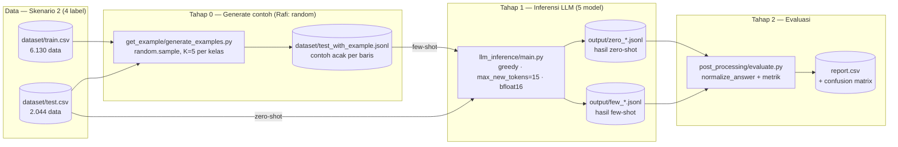
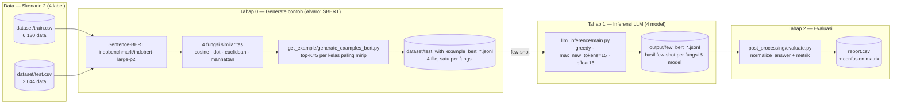

# Diagram Alir Penelitian

Diagram alir (Mermaid) untuk dua eksperimen klasifikasi konten pornografi teks
bahasa Indonesia (IndoNLU P2 — **Skenario 2, 4 label**):

- **Eksperimen 1** — mengikuti metode **Rafi Madani** (pemilihan contoh *random*).
- **Eksperimen 2** — mengikuti metode **Alvaro Luqman** (pemilihan contoh berbasis
  *similaritas semantik* Sentence-BERT).

Keduanya memakai alur 3 tahap yang sama dengan `reference/`:

> **generate contoh → inferensi LLM → evaluasi**

Satu-satunya perbedaan ada di **Tahap 0 (cara memilih contoh few-shot)**.

Diagram ini dirender oleh GitHub, VSCode (dengan ekstensi Mermaid), dan Kaggle.

---

## Eksperimen 1 — Metode Rafi (random) → Skenario 2 (4 label)

### Keterangan Eksperimen 1

| Bagian | Detail |
|---|---|
| Data | 4 label: `non_porno`, `percakapan_porno`, `penyebar_konten_porno`, `penjaja_seks` |
| Seleksi contoh | `random.sample`, K=5 per kelas (mengikuti `reference/get_example/get_example_random.py`) |
| Model | 5 LLM: Mistral-7B, Llama-3.1-8B, DeepSeek-7B, Qwen2.5-7B, SahabatAI-8B |
| Mode prompt | zero-shot (input `test.csv`) + few-shot (input `test_with_example.jsonl`) |
| Decoding | greedy, `max_new_tokens=15`, `bfloat16` |
| Evaluasi | Macro-F1 (+ precision/recall/F1 per kelas, confusion matrix) |

---

## Eksperimen 2 — Metode Alvaro (SBERT) → Skenario 2 (4 label)

### Keterangan Eksperimen 2

| Bagian | Detail |
|---|---|
| Data | Sama dengan Eksperimen 1 (4 label) |
| Seleksi contoh | Sentence-BERT `indobert-large-p2`, 4 fungsi similaritas (cosine, dot, euclidean, manhattan), K=5 per kelas paling mirip |
| Model | 4 LLM (Alvaro: tanpa DeepSeek): Mistral-7B, Llama-3.1-8B, Qwen2.5-7B, SahabatAI-8B |
| Mode prompt | few-shot saja (4 fungsi similaritas × model) |
| Decoding | greedy, `max_new_tokens=15`, `bfloat16` |
| Evaluasi | Macro-F1 (+ perbandingan antar fungsi similaritas) |

---

## Perbedaan Kunci Eksperimen 1 vs 2

| | Eksperimen 1 (Rafi) | Eksperimen 2 (Alvaro) |
|---|---|---|
| Seleksi contoh | Random (statis, acak) | SBERT (dinamis, paling mirip semantik) |
| Varian | zero + few | few saja, 4 fungsi similaritas |
| Model | 5 (termasuk DeepSeek) | 4 (tanpa DeepSeek) |
| Output Tahap 0 | 1 file JSONL | 4 file JSONL (satu per fungsi) |
